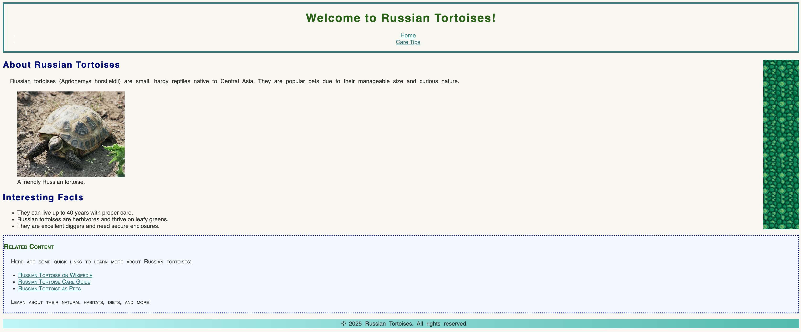

### U05-CW04 - Backgrounds and Borders (Lab)

**Objective:**  
Students will enhance the "Russian Tortoises" website using CSS properties for borders and backgrounds. This assignment introduces `border-color`, `border-style`, `border-width`, `background-color`, `background-image`, `background-repeat`, `background-size`, `background-gradient`, and `background-position`.

---

1. **Open Your Project**

   - Open your "Russian Tortoises" website files (`index.html`, `care.html`, and `styles.css`) in your text editor.

2. **Add Borders to the Header**

   - Find to the `/* Heading Styles */` comment.
   - Above the `/* Heading Styles */` comment, add a comment `/* Header Borders */` to your CSS file.
   - Apply borders to the `<header>`:
     - Border color: Teal (`#008080`).
     - Border style: Solid.
     - Border width: 4px.

3. **Set a Background Color for the Body**

   - Find the `/* Global Styles */` comment.
   - Add another declaration to set the `<body>` background color to light beige (`#f9f7f1`).

4. **Add a Background Gradient to the Footer**

   - Find the `/* Footer Styles */` comment.
   - Add another declaration to add a gradient background to the `<footer>`:
     - Linear-Gradient direction: left to right.
     - Colors: light teal (`#b0f7f7`) to medium teal (`#02bdb0`).

5. **Include a Background Image in the Main Section**

   - Find the `/* Aside Styling */` comment.
   - Above the `/* Aside Styling */` comment, add a `/* Main Section Background */` comment.
   - Underneath the comment, select the `<main>` tag
   - Add a background image to the `<main>`:
     - Use the `"tortoise-pattern.jpg"` image. Make sure that the image is inside the images folder!
     - Set the background to repeat vertically only.
     - Set the background size to `100px`.
     - Position the background at the right.

6. **Style the Aside with Borders and a Background Color**

   - Find the `/* Aside Styles*/` comment.
   - Add the another following declarations to the `<aside>` rule set:
     - Border color: Navy blue (`#000080`).
     - Border style: Dotted.
     - Border width: 3px.
     - Background color: Light blue (`#f0f8ff`).

7. **Test Your Changes**

- Open both `index.html` and `care.html` in Google Chrome to verify the updated text formatting and organization.
- Ensure all sections are styled consistently.
- Use the [W3C CSS Validator](https://jigsaw.w3.org/css-validator/) to ensure your CSS is valid.

8. **Submit Your Work**
   - Once you've confirmed that styling looks good, submit the following:
   - Submit your `styles.css` file inside of Google Classroom.
